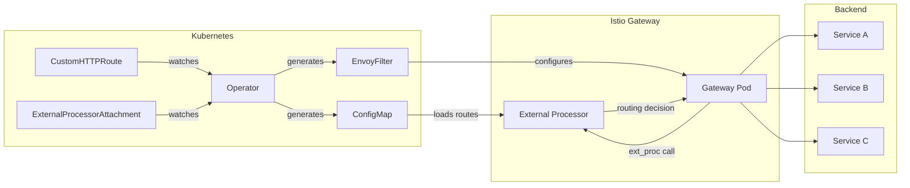

# CustomRouter

> [!WARNING]
> This project is under active development and evolving quickly. Some features may be missing, incomplete, or subject to change. Use in production at your own discretion.

Dynamic HTTP routing for Kubernetes with Envoy and Istio. Define your routing rules as Kubernetes resources and let CustomRouter handle the rest.

CustomRouter consists of two components that work together:
- **Operator**: Watches `CustomHTTPRoute` resources and compiles them into optimized routing tables
- **External Processor**: An Envoy ext_proc that receives requests from your gateway and routes them based on the compiled rules

## How it works



1. You create `CustomHTTPRoute` resources defining your routing rules
2. The operator compiles these rules into optimized ConfigMaps
3. You create an `ExternalProcessorAttachment` to connect the external processor to your gateway
4. The operator generates EnvoyFilters that configure Istio to use the external processor
5. Incoming requests hit the gateway, which calls the external processor
6. The external processor matches the request against the routing rules and tells Envoy where to send it

## Requirements

- Kubernetes v1.26+
- Istio v1.18+ (for gateway integration)
- Go v1.24+ (for development)

## Installation

### Using Helm (recommended)

```bash
helm install customrouter oci://ghcr.io/freepik-company/customrouter/helm-chart/customrouter \
  --namespace customrouter \
  --create-namespace
```

## Quick Start

### 1. Create routing rules

```yaml
apiVersion: customrouter.freepik.com/v1alpha1
kind: CustomHTTPRoute
metadata:
  name: my-routes
spec:
  # Target identifies which external processor handles these routes
  targetRef:
    name: default

  # Hostnames this route applies to
  hostnames:
    - www.example.com
    - example.com

  # Optional path prefixes (e.g., for i18n)
  pathPrefixes:
    values: [es, fr, de]
    policy: Optional  # Optional | Required | Disabled

  rules:
    # Simple prefix match (default)
    - matches:
        - path:
            value: /api
      backendRefs:
        - name: api-service
          namespace: backend
          port: 8080

    # Exact match with high priority
    - matches:
        - path:
            type: Exact
            value: /health
          priority: 2000
      backendRefs:
        - name: health-service
          namespace: infra
          port: 8080

    # Regex match
    - matches:
        - path:
            type: Regex
            value: ^/users/[0-9]+/profile$
      backendRefs:
        - name: users-service
          namespace: backend
          port: 8080

    # Default fallback (low priority)
    - matches:
        - path:
            value: /
          priority: 100
      backendRefs:
        - name: default-service
          namespace: web
          port: 80
```

### 2. Attach to your gateway

```yaml
apiVersion: customrouter.freepik.com/v1alpha1
kind: ExternalProcessorAttachment
metadata:
  name: production-gateway
  namespace: istio-system
spec:
  # Select which gateway pods to attach to
  gatewayRef:
    selector:
      istio: gateway-production

  # Reference to the external processor service
  externalProcessorRef:
    service:
      name: customrouter-extproc
      namespace: customrouter
      port: 9001
```

## Helm Chart Configuration

The chart supports deploying the operator and multiple external processors:

```yaml
# values.yaml
operator:
  enabled: true
  replicaCount: 1
  args:
    - --leader-elect
    - --health-probe-bind-address=:8081

externalProcessors:
  # Default processor
  default:
    enabled: true
    replicaCount: 2
    args:
      - --addr=:9001
      - --target-name=default
      - --access-log=true

  # Additional processor for different routes
  internal:
    enabled: true
    replicaCount: 1
    args:
      - --addr=:9001
      - --target-name=internal
      - --access-log=false

# Deploy additional resources
extraObjects:
  - apiVersion: customrouter.freepik.com/v1alpha1
    kind: CustomHTTPRoute
    metadata:
      name: my-routes
    spec:
      targetRef:
        name: default
      # ...
```

See [chart/values.yaml](chart/values.yaml) for all available options.

## Development

### Prerequisites

- Go v1.24+
- Docker
- kubectl
- A Kubernetes cluster (kind, minikube, etc.)

### Building

```bash
# Build all binaries
make build-all

# Build only the operator
make build

# Build only the external processor
make build-extproc
```

### Running locally

```bash
# Install CRDs
make install

# Run the operator locally
make run

# Run the external processor locally
make run-extproc
```

### Testing

```bash
# Run unit tests
make test

# Run e2e tests (requires a cluster)
make test-e2e
```

### Docker images

```bash
# Build all images
make docker-build-all

# Build and push all images
make docker-build-all docker-push-all
```

### Code generation

```bash
# Generate CRDs, RBAC, and DeepCopy methods
make generate manifests
```

### Available Make targets

Run `make help` to see all available targets:

```
Usage:
  make <target>

General:
  help             Display this help

Development:
  manifests        Generate CRDs and RBAC
  generate         Generate DeepCopy methods
  fmt              Run go fmt
  vet              Run go vet
  test             Run tests
  test-e2e         Run e2e tests

Build:
  build            Build operator binary
  build-extproc    Build external processor binary
  build-all        Build all binaries
  run              Run operator locally
  run-extproc      Run external processor locally

Docker:
  docker-build     Build operator image
  docker-build-extproc  Build external processor image
  docker-build-all Build all images
  docker-push      Push operator image
  docker-push-extproc   Push external processor image
  docker-push-all  Push all images

Deployment:
  install          Install CRDs
  uninstall        Uninstall CRDs
  deploy           Deploy to cluster
  undeploy         Undeploy from cluster
```

## Architecture

### CustomHTTPRoute

Defines routing rules for a set of hostnames. Rules are compiled into an optimized trie structure stored in ConfigMaps.

| Field | Description |
|-------|-------------|
| `targetRef.name` | Which external processor handles these routes |
| `hostnames` | List of hostnames this route applies to |
| `pathPrefixes` | Optional prefixes to prepend to all paths |
| `rules[].matches` | Path matching conditions |
| `rules[].backendRefs` | Target services |

### ExternalProcessorAttachment

Connects an external processor to Istio gateway pods by generating EnvoyFilters.

| Field | Description |
|-------|-------------|
| `gatewayRef.selector` | Labels to match gateway pods |
| `externalProcessorRef.service` | External processor service reference |

### Match Types

| Type | Description | Example |
|------|-------------|---------|
| `PathPrefix` | Matches path prefix (default) | `/api` matches `/api/users` |
| `Exact` | Matches exact path | `/health` only matches `/health` |
| `Regex` | Go regexp syntax | `^/users/[0-9]+$` |

### Priority

Routes are evaluated by priority (higher first). Default priority is 1000.

- Use high priority (e.g., 2000) for specific routes like `/health`
- Use low priority (e.g., 100) for catch-all routes like `/`

## License

Copyright 2026 Freepik Company.

Licensed under the Apache License, Version 2.0. See [LICENSE](LICENSE) for details.
